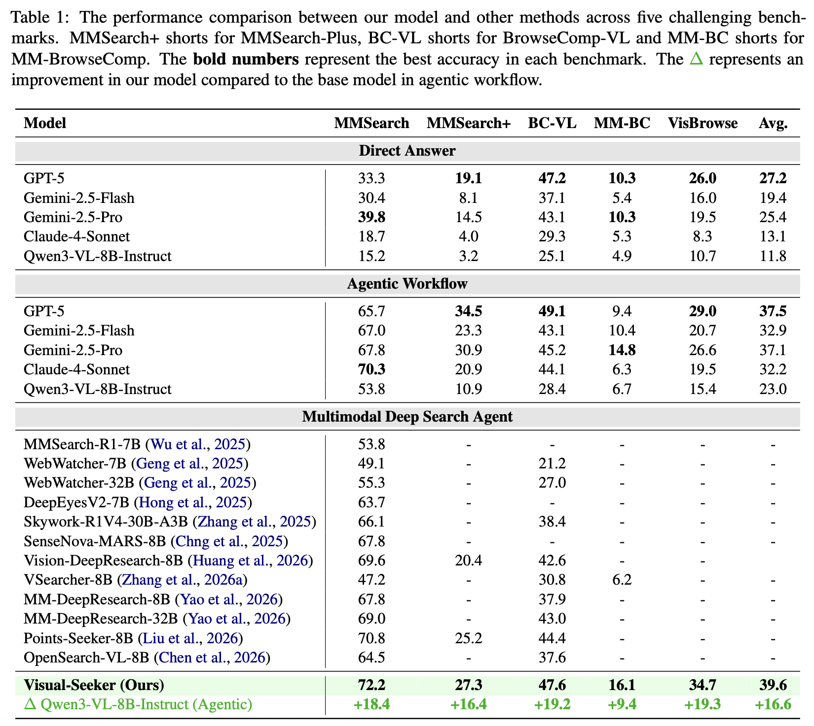

<div align='center'>
<h1>Visual-Seeker: Towards Visual-Native Multimodal Agentic Search via Active Visual Reasoning</h1>
</div>
<div align="center"> 

[](https://arxiv.org/abs/2606.15231)
[](https://huggingface.co/datasets/Zhengbo-Zhang/Visual-Seeker-train-data)
</div>

## 📣 News

- **[June 15, 2026]**: Our paper is now released on **[arXiv](https://arxiv.org/abs/2606.15231)**!

## 💡 Overview

Existing multimodal deep search agent primarily rely on simple images with explicit semantics and text-only evidence trajectories, limiting the agent's ability to perform multi-hop, cross-modal reasoning and search.


We propose **Visual-Seeker**, a visual-native multimodal deep search agent via active visual reasoning. To unlock its visual-native potential, we design an active visual reasoning data pipeline and synthesize high-quality multimodal trajectories for model training.

## 📊 Performance



## 📋 Todo list

- [x] Paper
- [ ] Model
- [ ] Data Demo
- [ ] Evaluation Code

## 📄 Citation
```bibtex
@misc{zhang2026visualseekervisualnativemultimodalagentic,
      title={Visual-Seeker: Towards Visual-Native Multimodal Agentic Search via Active Visual Reasoning}, 
      author={Zhengbo Zhang and Changtao Miao and Jinbo Su and Zhaowen Zhou and Chunxia Zhang and Xukai Wang and Ruiqi Liu and Kaiyuan Zheng and Jiansheng Cai and Bo Zhang and Zhe Li and Shiming Xiang and Ying Yan},
      year={2026},
      eprint={2606.15231},
      archivePrefix={arXiv},
      primaryClass={cs.AI},
      url={https://arxiv.org/abs/2606.15231}, 
}
```